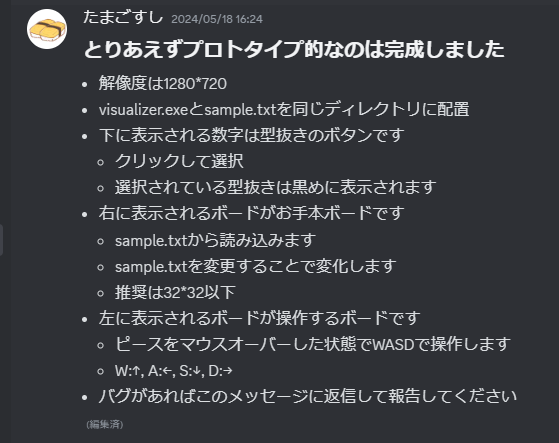
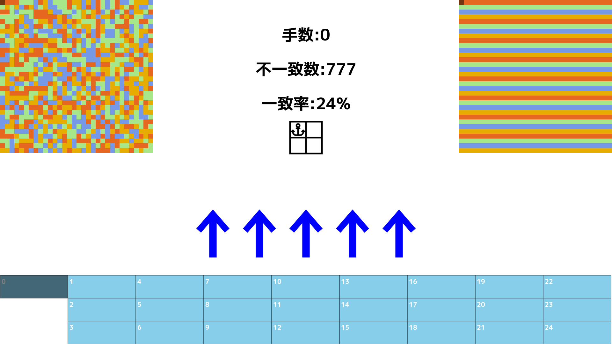
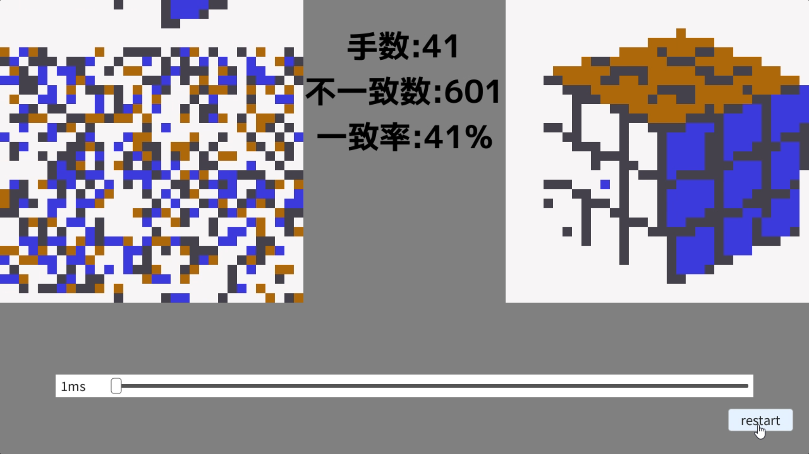
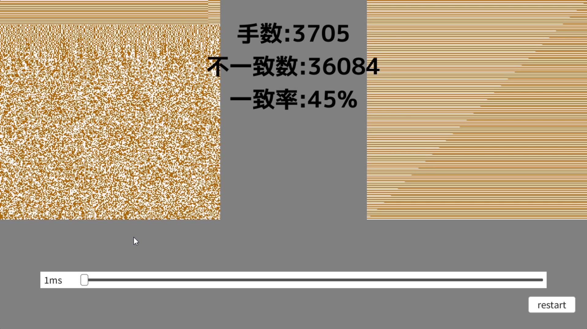
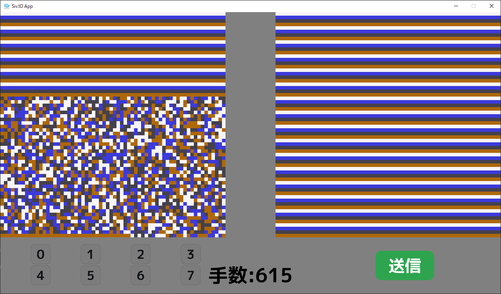
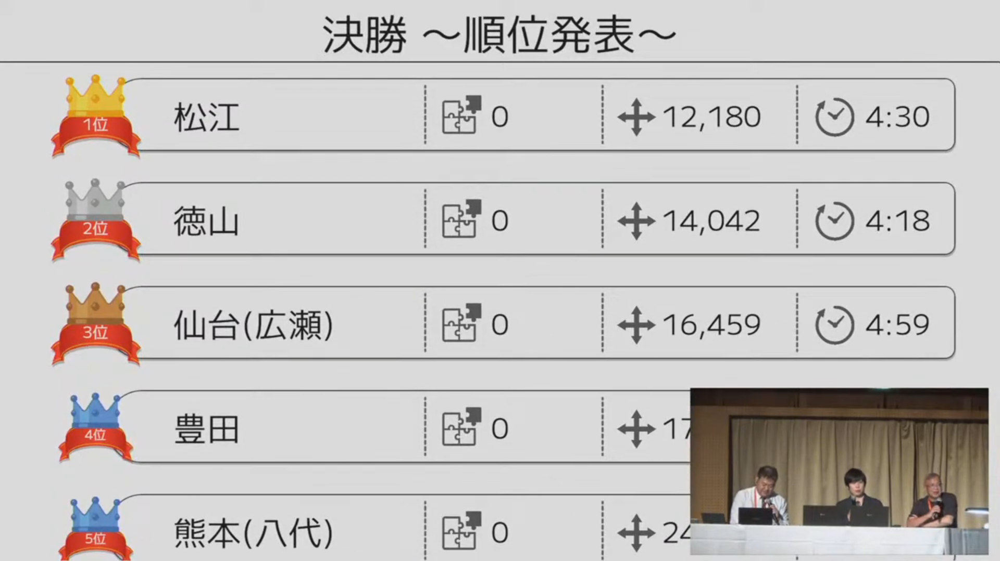

　全国高等専門学校プログラミングコンテスト第35回奈良大会に、競技部門として出場して **決勝4位(特別賞)** を取ることができました！  
　まあ私はvisualizerだけを作っており、アルゴリズムはつよつよ同級生とつよつよ1年生に任せていたので、肝心の解法にはノータッチだったのですが……  
　フレームワークとしてC++のOpenSiv3Dを使いました。去年から競技部門でもかなり人気になっているので、来年以降使う人に役立ててもらえればと思います。  
　[本校のリポジトリ](https://github.com/UScuber/procon35)を貼っておくので、どこか参考にしたい箇所があれば是非。

## 5月
　visualizer開発の中でここが一番全速力でした。最初からクライマックスですよ！  
　14日~18日で手動での操作機能を実装し、アルゴ班に考察を任せました。  
　  
　そのあとも色々弄り、手動機能は以下のようになりました。  
　  
　本当は一般抜き型も表示できるようにしたかったのですが、良い感じに表示できるUIが思いつかなかったので断念……  
　アルゴ班も「一般抜き型は考察しにくいから使わない」的なかんじだったのである意味ちょうどよかったです。

## 6月
　visualizerとsolverの実行ファイルの入出力を結んで、実行ファイルが出力した操作をvisualizerで表示するようにしました。  
　あと、ピースの色を外部ファイルで指定できるようにもしていました。チーム紹介動画の作成で使いました。（そこでしか役立っていない）
　

## 7・8月
　な～んにもしてなかったです。コミット履歴見たけどこの期間はすっからかん。  
　なんでかと言うと、単純に実装することがなかったからです。本当は通信機能の追加などあったんですけどね。
　それから、チームメンバーがそれぞれ別事で忙しかったというのもあります。

## 9月
　平穏な2ヶ月前とは違い、一気に慌ただしくなりました。リーダーの編入試が終わり、アルゴ班が本腰を入れ始めました。  
　通信機能を実装して、盤面描画を改良して、スライド処理を高速化(アルゴ班に任せた)して、スタックサイズの上限突破のためsolverをwsl内で非同期で動かすようにしたりと、まあ色々です。  
　この時に手動機能は消しました。もう使うことはないだろう、ということでコードが煩雑になる原因を取り除きました。もう来ないからね～  
　盤面描画を改善することで256×256でもぬるぬる描画できました。具体的には、これまで1ピースずつ四角形を描画していたところを、1ピース1pxとした画像を生成しDynamicTextureで描画させました。この実装のアイデアもチームリーダー発案でした。
　

## 10月
　ラストスパート！solverとの入出力を最適化したり、solverに渡すモードを選択できるようにしました。
　それと、本番でバグらないように通信部分についてはアホほどデバッグしまくってました。毎年ヒヤヒヤするんですよね。  
　ボタンなどのGUIは標準のものを使用していたのですが、デザインが質素すぎるのでオリジナルに差し替えたりもしました。
　

## 本番前日
　奈良へ出発する前に研究室で卒業研究中間発表の資料を書いていたところに、「モードごとに回答jsonを保持してほしい」という追加機能の要望が。
　「言われてみれば要るな......」と思ったので急いで実装して、卒研資料も爆速で終わらせ担当教員に投げつけ、学校を出発しました。  
　この日の夜、実行時間の検証をしていました。solverを直で動かした時の実行時間と、visualizerを通して動かしたときの実行時間を比べてみたところ、1分半ほどvisualizerが食っていることが判明。深夜まで原因を探したが突き止めきれず。明日の朝に回すことにしました。

## 本番当日
　うおおおおおお！探すぞ原因！ってことで開会式中もお構いなくノーパソ弄って探ってました。  
　そうして地道に時間計測してデバッグしまくっていたら見つけました！ **値渡し** だ！！！毎フレーム最大20000要素もあるjsonをコピーしていたらそりゃ時間かかるわ！ということでサクッと直してギリギリ予行練習に間に合いました。  
　チームメイトにはヒヤヒヤさせてたと思います。本当に申し訳ない。けど間に合ったからゆるして。

## 結果
　ということで、1回戦1位、準決勝2位突破で、ラスト決勝では4位となりました！アルゴ班ありがと～～～！！  
　visualizer担当としては、本番でバグが起こらなくて本当に良かったとほっとしております。何度デバッグしても不安になるものなんです。私がバグを起こしたらアルゴ班の努力が全て水の泡になってしまいますからね。  
　一般抜き型がまさかの文字だったり、優勝候補の高専が本番で不具合を起こしたりと、過去一で波乱万丈な大会だったと思います！ヒヤヒヤドキドキしながら大会に参加してました！  
　
　[第35回高専プロコン「競技部門2日目（敗者復活・準決勝・決勝）」](https://www.youtube.com/live/DBorqw6p_bM)

## これから
　これからと言っても私は今年で本科を卒業して専攻科に行くのですが、来年からは身を引こうかなと思っております。若い世代に任せるということで。  
　けれど今年チームメイトになった1年生に聞くと、メンバー集めに苦戦しているとのこと......流石にメンバーが集まらなかったら私も参加を考えます。
