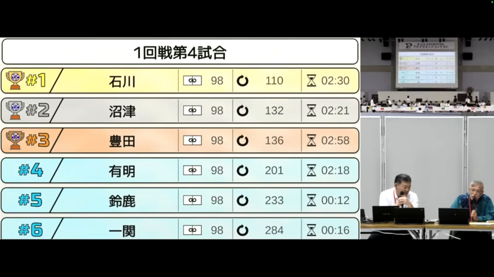

　全国高等専門学校プログラミングコンテスト第36回松江大会に、競技部門として出場しました。これで4年目となります。  
　成績は **ラストワン決定戦4位** でした！決勝出れず悔しい……  
　例年のごとく私はvisualizerを担当しており、アルゴリズムはつよつよ2年生に任せていました。  
　ただ今年は、私はインターン&研究、2年生たちはロボコンで忙殺されており、かなりカツカツギリギリの開発でした。  
　今年もビジュアライザの作成には、フレームワークとしてC++のOpenSiv3Dを使いました。  
　ここ最近は競技部門でよく使わている印象があるので、何かしらの参考になればと思います。  
　一応、[本校のリポジトリ](https://github.com/Tamagosushio/procon36)を貼っておきます。  

## 4月
　いつも通り、爆速でvisualizerのプロトタイプを作成。  

　キーボード入力でフィールドを操作できるやつです。  
　実装自体は簡単にできたのですが、見せ方が難しい……  
　この画像みたいにエンティティが多くなると、HSVの色相をずらすだけではぱっと見で分かりにくくなってしまう。Um……  
　ただ、これ以外に思いつかなかったので、やむなくこの方針で実装しました。このころから公式visualizerが楽しみでしたね。  

## 5・6・7月
　研究！研究！研究！ってかんじでした。つまりvisualizerは何もしてないですね。  
　そしてアルゴ班2年生達はロボコンへ出張……プロコン関連全体が止まっていた時期でした。  

## 8・9月
　7/30に簡易サーバーが来たので、本番の構成を見据えた実装をしました。  
1. サーバーから問題を取得
2. solverへ問題データを渡す
3. solverの計算
4. solverから操作手順を取得
5. サーバーへ操作手順を送信
　といった流れです。去年と同じですね。  

　その後も細々とした調整などを行いました。  
　そして計3週間のインターンへ……      
　インターン終了後、専攻科の中間発表が近かったため、行った検証をまとめたり提出資料を作成したり発表練習をしたりでした。  
　そうして少しだけ落ち着いたごろに、通信周りの例外処理が雑すぎることに気づきました。通信なんて例外於きまくるのにね。  
　そしてちょっとした修正&調整したら、中間発表へ……  

## 10月
　中間発表が終わり、プロコン資料なども片付け、後輩のロボコンが終わり……  
　となっていたらもう大会1週間前でした！ヤバイわよ！  
　アルゴ班の進捗があまりよろしくなかったため、考察にも加わりました。あまり貢献はできませんでしたが……。  

## 本番前日
　大会会場へ向かうバスの移動中にアルゴ班がsolverを実装してくれました。  
　さっそくこっちの環境でテストしようとしたところ、スタックサイズが上限に達してしまいました。  
　この問題は去年も発生したため、同様の対処でwslでsolverを動かすことに。  
　が、visualizerとsolverをつなぐと上手くいかない……とにかく原因を潰しまくる。。  
　ホテルにチェックインしてから原因が判明しました。  
　solverは前計算しておいたバイナリファイルを最初に読み込むのですが、実行時のカレントディレクトリがずれていることが判明。  
　仕方がないのでパワー解決。`C:\Windows\System32`にバイナリファイルを直接ぶち込みました。  

## 大会1日目
　予行練習を無事に終え、いざ一回戦！  
　ひとまず3位通過で準決勝進出確定しました！ 
 
　公式visualizerを見て「これは分かりやすいな～」と感じたので、一回戦終了後に実装に取り掛かりました。  
　無事に完了。  
　また、アルゴ班がsolverの並列化で困っていたため、すこし手伝ったりもしました。  

## 大会2日目
　朝起きてアルゴ班と話してると、solverに解かせた後に人力操作を追加する絹雄が欲しいという要望が。  
　ビームサーチだけだと最後の残り数ペアがそろわないため、この部分を人力で行うのはどうかとアイデアでした。  
　う～ん、できそう！準決勝が始まるまでに急いで実装しました。  
　まあ結局人力操作が難しすぎるため使うことはなかったのですが。  
　そしてそのまま準決勝へ。準決勝は3位と一歩届かず、次のラストワン決定戦への出場が決まりました。  
　そしてラストワン決定戦では4位。私たちの秋はここで終わってしまった……  

## 結果
　というわけで、最終成績はラストワン決定戦4位！本当にお疲れさまでした～～！  
　前回の記事でも書きましたが、visualizer担当としては、本番でバグが起こらなくて本当に良かったとほっとしております。  
　準決勝では回答の送信が公式visualizerにすぐに反映されず。送信してから反映されるまでの数十秒間は冷や汗をかきまくってました。  

[第36回高専プロコン「競技部門2日目（敗者復活・準決勝・決勝）」](https://www.youtube.com/live/17TcESvPbFg)

## これから
　今回は会場が島根の松江ということで、たまたま私と微小な縁があったため参加することにしました。  
　来年は流石に出ないと思います……が、2年生2人のうちの1人が留学に行ってしまうとのこと。  
　人数不足で出れそうになったら、私が埋めで出場しようかと思います。  
　今大会も、どの高専も非常にレベルが高い戦いでした！お疲れさまでした！  

