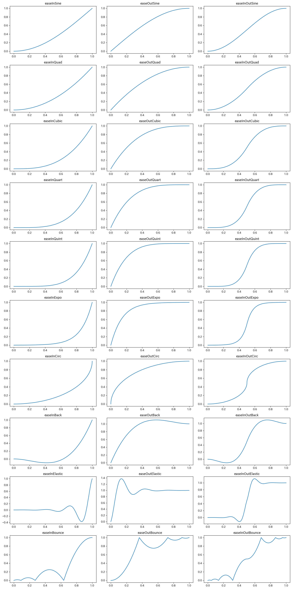
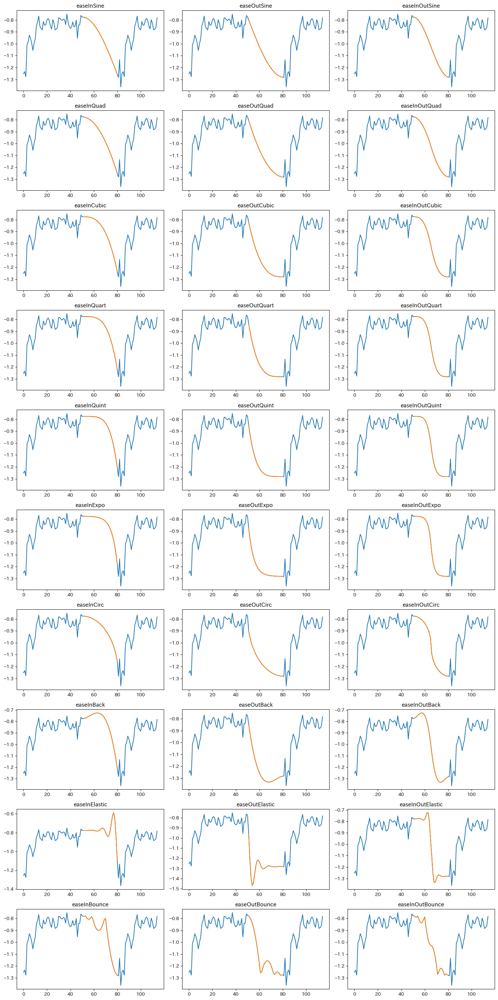

## 動機
　実は私、研究室では手話の研究を行っておりまして、機械学習には時系列データをぶち込むんですよ。  
　そこで、別々の手話を表す2つの時系列データを繋げて、データ量を水増ししようみたいな試みがありまして、愚直な線形で繋げる以外にも色々緩急をつけてみよう。それでイージング関数を作ることにしました。  
　[作成したレポジトリはこちらに。](https://github.com/Tamagosushio/Easing-Python)  

## 実装
　[イージング関数チートシート](https://easings.net/ja)を参考にしました。AviUtlで散々見たやつですね。  
　数式の定義が載っているのですが、TypeScriptで書かれているのでそ、Pythonに変換にする必要がありました。  
　あまりにそのまま変換したので、ひどいものは
```python
def easeInOutElastic(x):
  0.0 if x == 0.0 else 1.0 if x == 1.0 else -(math.pow(2, 20*x - 10)*math.sin((20*x - 11.125) * __c5__))/2 if x < 0.5 else (math.pow(2, -20*x + 10)*math.sin((20*x - 11.125)*__c5__))/2 + 1
```
　のような三項演算子のオンパレードになってしまいました。まあ動けばよし！  
　とまあこんなかんじで、10*3種類のイージング関数を作りました。

## 結果
　0.0~1.0の連続値をイージング関数に入れたものが下のグラフ群になります。  
　まあまあ成功してますね！
　
　これを研究で使っているデータに適用してみました。  
　-0.8で終わって-1.3から始まるデータをイージング関数を使って繋げてみたらこんなかんじ。  
　青色が元データの部分で、橙色のが接続した部分です。
　
　なんだかとってもいいかんじ～  

## おわり
　ざっと調べたかんじ、イージング関数がpip等のライブラリになかったので作ってみました。  
　pipの登録って結構簡単にできるみたいなので、ファイル整備したらやってみようかな～。

