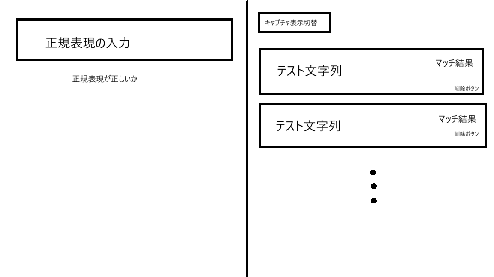
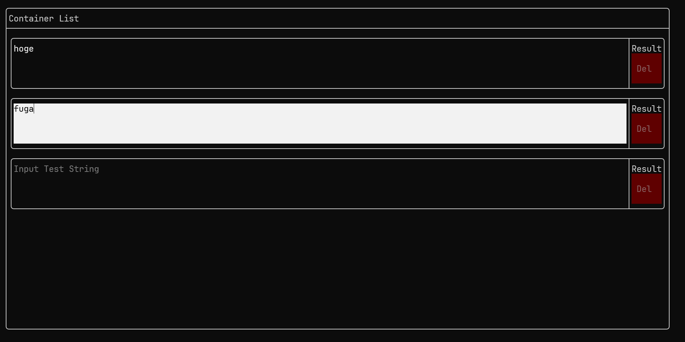
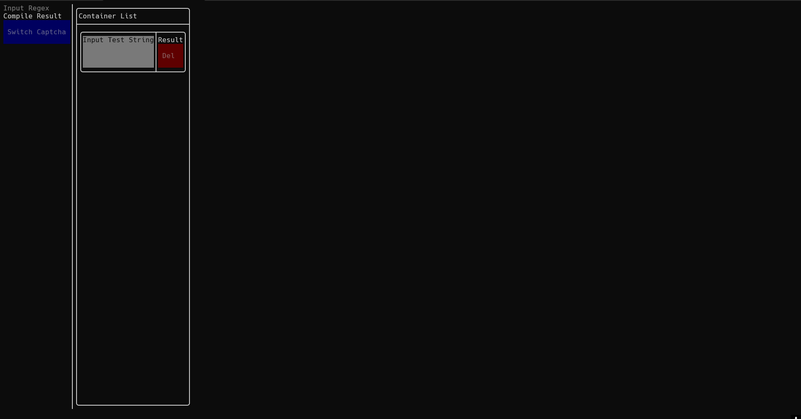
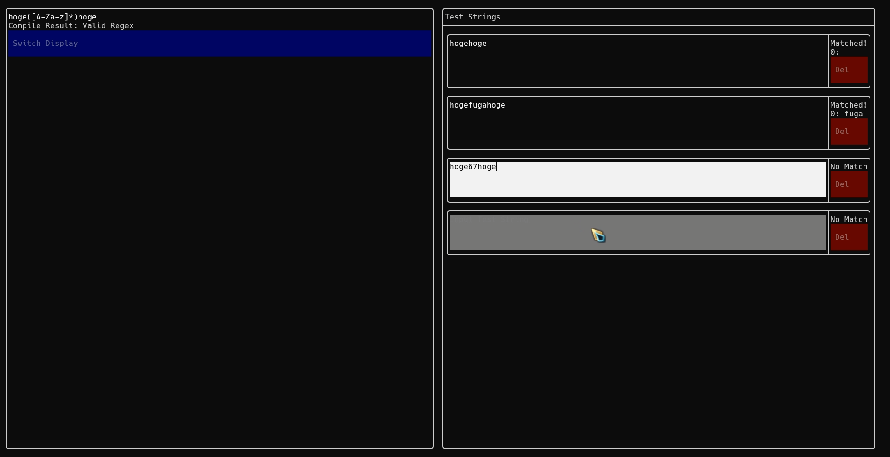
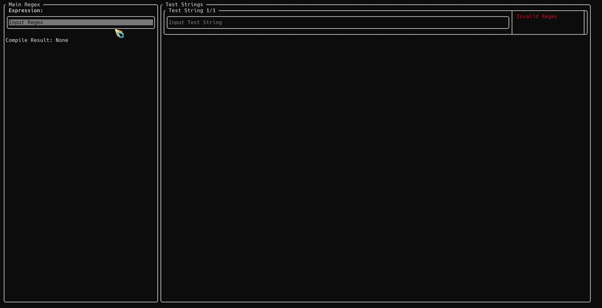
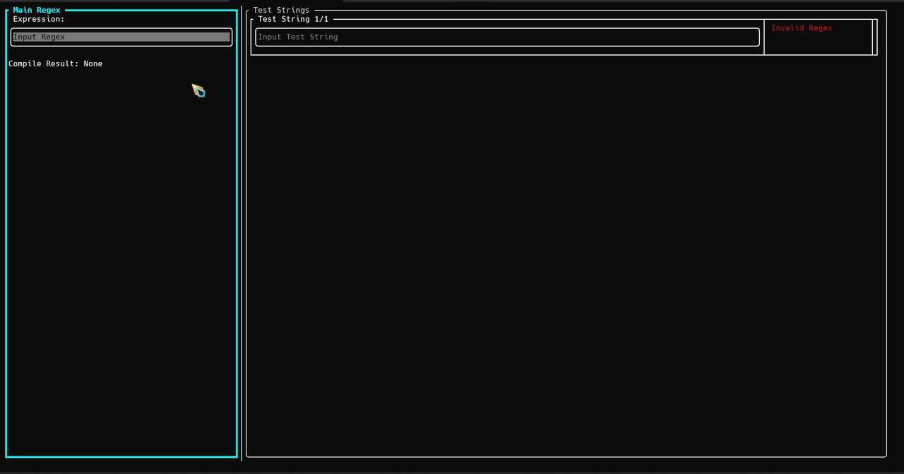
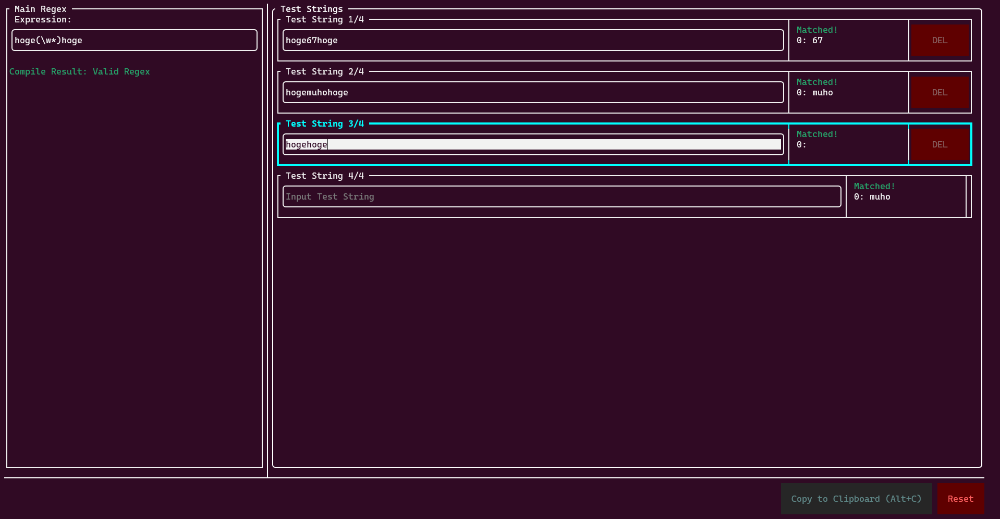
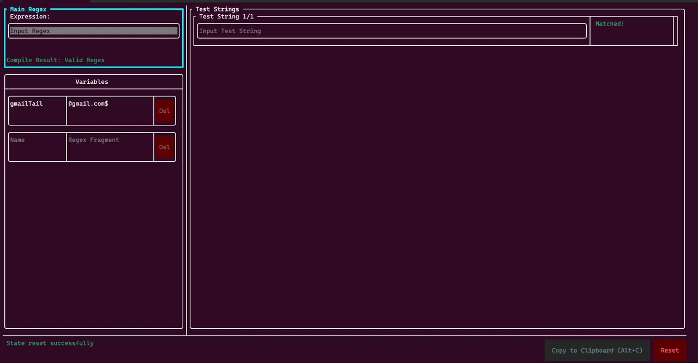
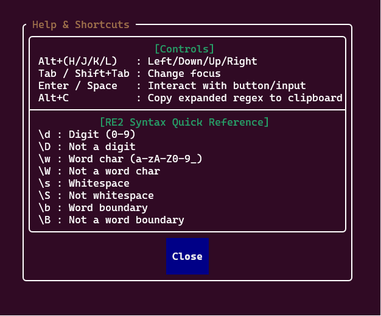

## はじめに
アプリ作成と平行してこの記事を書いてみます。今までの記事は一通り作成し終わってから書いていたのですが、リアルタイム感が足りないなあと思ったので試しにやってみます。  
私が研究で使っているプログラムは、機械学習の終了時に結果を出力しています。出力形式はテキストファイルで、まとめようとしたときに少し手間でした。結果を抽出するのに繰り返しコピペしてもいいのですが、せっかくなので正規表現で取り出してみようかと。  
ただ私は正規表現を頻繁に利用する方ではないので、何か補助するツールが欲しい。知の集合インターネットを探せばいくらでもありますが、ローカルのツールが欲しい。なので私マイブームのTUIで作ってみよう！となったわけですね。
ああ名前の"Retui"は、"Regex"+"TUI"です。うん、わかりやすい。  

この記事はコードをちょくちょく挟んでいます。あまり興味のない方は本文とか画像とかを見てくれればと。  
[Retuiのレポジトリ](https://github.com/Tamagosushio/Retui) はこちらに。

## 仕様を列挙してみる
ひとまず欲しい機能を列挙。
- キーボード操作で完結
- リアルタイムでマッチング処理
- キャプチャグループによる文字列抽出
- 入力した正規表現をクリップボードにコピー
- 前回の状態を保持、復元

## 開発環境構築
使ったことのあるC++TUIライブラリの [FTXUI](https://github.com/ArthurSonzogni/FTXUI) を使います。  
正規表現はC++標準のregexを使おうかと思いましたが、Google製のよりセーフな正規表現エンジン [re2](https://github.com/google/re2) 。
状態の保持にはJSONを使用し、その読み書きには [nlohmann/json](https://github.com/nlohmann/json) を使うことにします。  

## CMakeを使う
早速 `CMakeLists.txt` を書いてコンパイル……のはずが、どうやらre2を使うにはabseilなるライブラリも必要となるらしい。バージョンを落とせば依存関係なしでre2は使えますが、せっかくなので最新バージョンを使います。  
コンパイルしてエラーを調べて修正してを繰り返し、最終的に以下のようになりました。  
```CMake
cmake_minimum_required(VERSION 3.14)
project(Retui CXX)

set(CMAKE_CXX_STANDARD 20)
set(CMAKE_CXX_STANDARD_REQUIRED ON)
set(CMAKE_CXX_EXTENSIONS OFF)

include(FetchContent)

# FTXUI
FetchContent_Declare(ftxui
  GIT_REPOSITORY https://github.com/ArthurSonzogni/ftxui
  GIT_TAG        v6.1.9
)
FetchContent_MakeAvailable(ftxui)

# abseil
set(ABSL_PROPAGATE_CXX_STD ON CACHE BOOL "" FORCE)
set(ABSL_ENABLE_INSTALL ON CACHE BOOL "" FORCE)
FetchContent_Declare(absl
  GIT_REPOSITORY https://github.com/abseil/abseil-cpp.git
  GIT_TAG        20260107.1
)
FetchContent_MakeAvailable(absl)

# re2
set(RE2_BUILD_TESTING OFF CACHE BOOL "" FORCE)
FetchContent_Declare(re2
  GIT_REPOSITORY https://github.com/google/re2.git
  GIT_TAG        2025-11-05
)
FetchContent_MakeAvailable(re2)

# nlohmann/json
FetchContent_Declare(json
  GIT_REPOSITORY https://github.com/nlohmann/json.git
  GIT_TAG        v3.12.0
)
FetchContent_MakeAvailable(json)

# 実行ファイルの追加
add_executable(retui src/main.cpp)

# ライブラリのリンク
target_link_libraries(retui
  PRIVATE
    ftxui::screen
    ftxui::dom
    ftxui::component
    re2::re2
    nlohmann_json::nlohmann_json
)
```

## 設計する
機能ごとにクラスを分割します。  
1. TUIの構築→ `TuiController`
2. 正規表現の処理→ `RegexMatscher`
3. アプリの状態保持→ `AppState`
4. アプリ全体の管理→ `RetuiApp`
5. クリップボードの処理→ `ClipboardManager`

ひとまずはこの5つに分けることにします。  

## 画面構築
先ほどクラス分割をしましたが、それはひとまず置いておいて、まずは画面構築から着手しましょう。  
適当なペイントソフトでUIを書いて、イメージを固めます。最終的にはこのようになりました。  
あまりに雑すぎますが、作っているうちに良い見た目になるでしょう。多分。  


始めに、複雑な方の右側 `TestStringsContainer` を作成します。操作の利便性などは後回しにして、リストの表示と文字列の入力、要素の追加・削除の最低機能を実装しました。  
結果はこのようになりました。

```cpp
#include <string>
#include <vector>
#include <functional>

#include <ftxui/component/component.hpp>
#include <ftxui/component/component_base.hpp>
#include <ftxui/component/component_options.hpp>
#include <ftxui/component/screen_interactive.hpp>
#include <ftxui/dom/elements.hpp>

namespace retui {

using namespace ftxui;

/// @brief テスト文字列とマッチ結果、削除ボタンを管理するコンポーネント
class TestStringBox : public ComponentBase {
public:
  /// @brief 入力時削除時のコールバックを設定
  /// @param on_change テキスト変更時の処理
  /// @param on_delete 削除ボタン押下時の処理
  explicit TestStringBox(std::function<void()> on_change, std::function<void(TestStringBox*)> on_delete) {
    InputOption option;
    option.on_change = on_change;
    input_box_ = Input(&test_string_, "Input Test String", option);
    delete_button_ = Button(
      "Del",
      [this, on_delete]() { on_delete(this); },
      ButtonOption::Animated(Color::Red)
    );
    Component internal_container = Container::Horizontal({
      input_box_,
      delete_button_,
    });
    Add(internal_container);
  }
  Element OnRender() override {
    return hbox({
      input_box_->Render(),
      separator(),
      vbox({
        text(match_result_),
        delete_button_->Render(),
      }),
    }) | border;
  }
  bool OnEvent(Event event) override {
    return ComponentBase::OnEvent(event);
  }
  bool Focusable() const override {
    return ComponentBase::Focusable();
  }
  bool IsEmpty() const {
    return test_string_.empty();
  }
private:
  std::string test_string_;
  std::string match_result_ = "Result";
  Component input_box_;
  Component delete_button_;
};

/// @brief 複数のTestStringBoxを管理し、動的に追加・削除を行うコンポーネント
class TestStringsContainer : public ComponentBase {
public:
  TestStringsContainer() {
    test_strings_container_ = Container::Vertical({});
    Add(test_strings_container_);
    AddBox();
  }
  Element OnRender() override {
    return vbox({
      text("Container List"),
      separator(),
      test_strings_container_->Render(),
    }) | border;
  }
  bool OnEvent(Event event) override {
    return ComponentBase::OnEvent(event);
  }
  bool Focusable() const override {
    return ComponentBase::Focusable();
  }
private:
  void AddBox() {
    std::shared_ptr<TestStringBox> box = std::make_shared<TestStringBox>(
      [this]() { AddNewOnConditioner(); },
      [this](TestStringBox* target) { RemoveBox(target); }
    );
    boxes_.push_back(box);
    test_strings_container_->Add(box);
  }
  void AddNewOnConditioner() {
    if (!boxes_.empty() && !boxes_.back()->IsEmpty()) {
      AddBox();
    }
  }
  void RemoveBox(TestStringBox* target) {
    auto iter = std::find_if(boxes_.begin(), boxes_.end(),
      [target](const std::shared_ptr<TestStringBox>& box) {
        return box.get() == target;
      }
    );
    if (iter != boxes_.end()) {
      (*iter)->Detach();
      boxes_.erase(iter);
    }
    if (boxes_.empty()) {
      AddBox();
    }
  }
  std::vector<std::shared_ptr<TestStringBox>> boxes_;
  Component test_strings_container_;
};

} // namespace retui
```
コンポーネント志向のコードになりました。入力時の処理や削除ボタンの処理をラムダ式として親部品から与えてやるとか、Reactみたいなコードが多くなりましたね。  

今度は左側の正規表現入力部 `RegexContainer` を作成します。正規表現の処理とかは後回しにして、最小限のパーツと処理を作っておきます。  
右側よりも簡単な作りなので、特に語ることもないでしょう。ボタンの処理なども後回しにしています。  
```cpp
class RegexContainer : public ComponentBase {
public:
  RegexContainer() {
    input_regex_ = Input(&input_regex_string_, "Input Regex");
    switch_captcha_button_ = Button(
      "Switch Captcha",
      [](){},
      ButtonOption::Animated(Color::Blue)
    );
    Component regex_container = Container::Vertical({
      input_regex_,
      switch_captcha_button_,
    });
    Add(regex_container);
  }
  Element OnRender() override {
    return vbox({
      input_regex_->Render(),
      text(regex_compile_result_),
      switch_captcha_button_->Render(),
    });
  }
  bool OnEvent(Event event) override {
    return ComponentBase::OnEvent(event);
  }
  bool Focusable() const override {
    return ComponentBase::Focusable();
  }
private:
  std::string input_regex_string_;
  Component input_regex_;
  std::string regex_compile_result_;
  Component switch_captcha_button_;
};
```

次はこれら2つをまとめる `TuiController` を作ります。こちらも特に大したことはしていません。  
そしてできたものがこちらになります。やけに左に偏ってたりキーボード操作で左右移動ができなかったりと不便さがありますが、ひとまずはこれで良いでしょう。こうしたUIやユーザービリティの改良はやり始めるときりがないので。  
```cpp
class TuiController : public ComponentBase {
public:
  TuiController() {
    test_strings_container_ = std::make_shared<TestStringsContainer>();
    regex_container_ = std::make_shared<RegexContainer>();
    Component controller_container = Container::Horizontal({
      test_strings_container_,
      regex_container_,
    });
    Add(controller_container);
  }
  Element OnRender() override {
    return hbox({
      regex_container_->Render(),
      separator(),
      test_strings_container_->Render(),
    });
  }
  bool OnEvent(Event event) override {
    return ComponentBase::OnEvent(event);
  }
  bool Focusable() const override {
    return ComponentBase::Focusable();
  }
private:
  std::shared_ptr<TestStringsContainer> test_strings_container_;
  std::shared_ptr<RegexContainer> regex_container_;
};
```
  

動作が確認できたので、ファイル分離しておきます。 `TuiController.hpp` と `TuiController.cpp` に宣言と実装を分け、 `CMakeLists.txt` にこのソースファイルを追加しました。
```CMake
add_executable(retui
  src/main.cpp
  src/TuiController.cpp
)
```

## 正規表現の処理を作る
次は正規表現の `RegexMatcher` を作ります。先に書いたようにgoogle製のre2を使用して、正規表現のコンパイル、マッチ処理、その結果のゲッターなどのメソッドを作ります。また、デバッグ用のプリント関数も簡単に実装しておきます。  
re2における正規表現処理は、正規表現の文字列をコンパイルしたのち、テスト文字列とマッチ処理を行わせます。キャプチャグループがある場合には配列に入れましょう。デバッグプリントでは、ranged base forの中でインデックスを宣言しています。C++20から使える文法ですが、自分でインクリメントしないといけないところには注意です。（１敗）  
```cpp
class RegexMatcher {
public:
  void Compile(const std::string& regex) {
    re2::RE2::Options options;
    options.set_log_errors(false);
    re2_ = std::make_unique<re2::RE2>(regex, options);
    is_valid_ = re2_->ok();
    error_message_ = is_valid_ ? "" : re2_->error();
  }
  void Execute(const std::string& text) {
    captured_groups_.clear();
    if (!re2_ || !is_valid_) {
      is_match_ = false;
      return;
    }
    int num_groups = re2_->NumberOfCapturingGroups();
    if (num_groups == 0) {
      is_match_ = re2::RE2::PartialMatch(text, *re2_);
      return;
    }
    std::vector<re2::StringPiece> matches(num_groups + 1);
    re2::StringPiece input(text);
    is_match_ = re2_->Match(input, 0, input.size(), re2::RE2::UNANCHORED, matches.data(), matches.size());
    if (IsMatch()) {
      captured_groups_.reserve(num_groups);
      for (int i = 1; i <= num_groups; i++) {
        captured_groups_.emplace_back(matches[i].data(), matches[i].size());
      }
    }
  }
  std::vector<std::string> GetCapturedGroups() const {
    return captured_groups_;
  }
  bool IsValid() const {
    return is_valid_;
  }
  bool IsMatch() const {
    return is_match_;
  }
  std::string GetErrorMessage() const {
    return error_message_;
  }
  void DebugPrint() const {
    std::cout << (IsValid() ? "Valid" : "Invalid") << std::endl;
    if (IsValid()) {
      std::cout << (IsMatch() ? "Match" : "Unmatch") << std::endl;
      for (int i = 0; const std::string& captured_group : GetCapturedGroups()) {
        std::cout << i++ << "-index:\t" << captured_group << std::endl;
      }
    }
    std::cout << (GetErrorMessage() == "" ? "No Error" : GetErrorMessage()) << std::endl;
  }
private:
  std::unique_ptr<re2::RE2> re2_;
  std::vector<std::string> captured_groups_;
  std::string error_message_;
  bool is_valid_ = false;
  bool is_match_ = false;
};
```

## フロントとバックを繋げる
そしたらば `RetuiApp` で、はUI層 `TuiController` とロジック層 `RegexMatcher` の橋渡ししてやります。メインの正規表現やテスト文字列を受け取って、`RegexMatcher` に処理をさせ、結果をUIに返すのが仕事となります。  

```cpp
class RetuiApp {
public:
  void SetMainRegex(const std::string& regex);
  void SetTestText(const std::string& text);
  MatchResult GetMatchResult() const;

private:
  std::string main_regex_;
  std::string test_text_;
  RegexMatcher regex_matcher_;
};
```

また結果をまとめて返しやすくするために、 `RegexMatcher.hpp` で、新しく `MatchResult` 構造体を定義しました。  
```cpp
struct MatchResult {
  bool is_valid_regex;
  bool is_match;
  std::string error_message;
  std::vector<std::string> captured_groups;
};
```

実装側では、UIから受け取った文字列を `RegexMatcher` に流し込みます。
```cpp
void RetuiApp::SetMainRegex(const std::string& regex) {
  main_regex_ = regex;
  regex_matcher_.Compile(main_regex_);
  
  if (!test_text_.empty()) {
    regex_matcher_.Execute(test_text_);
  }
}

void RetuiApp::SetTestText(const std::string& text) {
  test_text_ = text;
  regex_matcher_.Execute(test_text_);
}

MatchResult RetuiApp::GetMatchResult() const {
  return regex_matcher_.GetMatchResult();
}
```

これに合わせて、UI側の `TuiController` にも手を入れていきます。
これまでは適当なダミー文字列を表示しているだけでしたが、コンストラクタで `RetuiApp` のポインタを受け取るようにし、テキストボックスの入力が変更された際にコールバックを発火させるようにしました。
```cpp
void TuiController::OnRegexChange(std::string regex) {
  app_->SetMainRegex(regex);
  auto result = app_->GetMatchResult();
  regex_container_->SetError(result.error_message);
  for (const auto& box : test_strings_container_->GetBoxes()) {
    EvaluateBox(box.get());
  }
}

void TuiController::OnTestStringChange(TestStringBox* box) {
  EvaluateBox(box);
}

void TuiController::EvaluateBox(TestStringBox* box) {
  app_->SetTestText(box->GetText());
  box->SetMatchResult(app_->GetMatchResult());
}

void TuiController::OnToggleDisplay() {
  show_capture_details_ = !show_capture_details_;
  test_strings_container_->SetShowCaptureDetails(show_capture_details_);
}
```
これで、左側の正規表現を入力したときや、右側のテスト文字列を入力したときに、リアルタイムでマッチング処理が走るようになりました。  

もちろん、エントリーポイントである `main.cpp` も更新して、 `RetuiApp` のインスタンスをコントローラーに渡すようにしています。
```cpp
#include "TuiController.hpp"
#include "RetuiApp.hpp"

#include <ftxui/component/screen_interactive.hpp>

int main() {
  retui::RetuiApp app;
  auto controller = std::make_shared<retui::TuiController>(&app);
  auto screen = ftxui::ScreenInteractive::Fullscreen();
  screen.Loop(controller);
  return 0;
}
```
  

## UIの改善
このUIは不便すぎる。入力欄を移動するためにマウス操作をしなければならないし、表示も小さくて見づらい。諸々の改善の後にUIに取り掛かろうと思いましたが、先にやっちゃいます。  
まずは見た目から。以前はただの `border` で囲まれていただけのコンポーネントを、 `window` デコレータを使って枠線にタイトルを付けたり、`hbox` や `vbox` に余白や区切り線を挟んでレイアウトを整えました。また、マッチ結果に応じて "Matched!" を緑色に、"Invalid Regex" を赤色にするなどもしました。  
更にマウス操作にもメスを入れましょう。FTXUIは標準で、コンポーネントの配置に応じてTabキーや矢印キーでフォーカスを移動できますが、ターミナル上でガシガシ正規表現をテストするには、矢印キーでの操作は少し面倒。  
そこで、`Alt + H/J/K/L` を矢印キーの入力としてインターセプトする処理を `TuiController::OnEvent` に追加しました。（`Ctrl` キーとの組み合わせはターミナルの標準ショートカットと干渉しがちなので、今回は `Alt` を採用しました。ターミナルでの `Ctrl + H` はBackspaceとして扱われるんですね……。）

```cpp
bool TuiController::OnEvent(Event event) {
  if (event == Event::AltH) event = Event::ArrowLeft;
  else if (event == Event::AltJ) event = Event::ArrowDown;
  else if (event == Event::AltK) event = Event::ArrowUp;
  else if (event == Event::AltL) event = Event::ArrowRight;
  return ComponentBase::OnEvent(event);
}
```

最後の大きな改善として、キャプチャ表示のトグルボタンを削除し、結果をシンプルにリスト表示するように変更しました。表示スペースに余裕があり、わざわざ表示切り替えをする必要性がなさそうでしたので。  
また、右側の「Test String」ボックスのタイトルに「現在の番号/全体の個数」を動的に表示させたり、最後の空の入力ボックスからは「Del」ボタンを非表示にして無駄な操作を防がせたりしています。



微妙っぽかったのでもう少しだけUIを弄ります。まず、フォーカス中のウィンドウ枠をシアン色で強調。さらに、Test Stringが複数あり表示がはみ出ても良いように、縦スクロールバーを追加しました。色がつくと一気にそれっぽく見えますね。  




## クリップボードへのコピー
クリップボードの処理はOSごとに異なるので、WindowsとLinuxの2パターンで処理を分けます。  

```cpp
#ifdef _WIN32
#include <windows.h>
#else
#include <stdio.h>
#endif

bool ClipboardManager::CopyToClipboard(const std::string& text) {
#ifdef _WIN32
  if (!OpenClipboard(nullptr)) {
    return false;
  }
  EmptyClipboard();
  HGLOBAL hMem = GlobalAlloc(GMEM_MOVEABLE, text.size() + 1);
  if (hMem) {
    memcpy(GlobalLock(hMem), text.c_str(), text.size() + 1);
    GlobalUnlock(hMem);
    SetClipboardData(CF_TEXT, hMem);
  } else {
    CloseClipboard();
    return false;
  }
  CloseClipboard();
  return true;
#elif defined(__linux__)
  FILE* pipe = popen("wl-copy 2>/dev/null || xclip -selection clipboard 2>/dev/null || xsel --clipboard --input 2>/dev/null", "w");
  if (pipe) {
    size_t written = fwrite(text.c_str(), 1, text.size(), pipe);
    int result = pclose(pipe);
    return (result == 0 && written == text.size());
  }
  return false;
#else
  return false;
#endif
}
```

まずWindows。Windows環境であればwin32apiヘッダを読み込みます。始めの `if(!OpenClipboard(nullptr))` で、クリップボードと関連付けるウィンドウハンドルを指定します。 `nullptr` を渡すことで、現在のタスクに紐づけることができます。 `EmptyClipboard()` でクリップボード内のデータを空にします。その後、 `GlobalAlloc(GMEM_MOVEABLE, text.size() + 1)` で、グローバルのメモリ領域を確保します。メモリサイズは、最後にヌル文字が入るので文字数+1しておきます。 確保したメモリ領域に `memcpy(GlobalLock(hMem), text.c_str(), text.size() + 1)` で文字列をコピーします。 `GlobalLock(hMem)` は、確保した領域をロックし、書き込み可能なポインタを取得します。 ロックしたので書き込み後は `GlobalUnlock(hMem)` でロックを解除します。 `SetClipboardData(CF_TEXT, hMem)` で、クリップボードに文字列としてデータをセットします。最後に `CloseClipboard()` で、クリップボードを解放します。ハンドル `hMem` の解放は、クリップボード側の処理で行ってくれます。  

Linuxでは、入出力関数を使うためにstdioヘッダを読み込みます。 `wl-copy`、 `xclip`、 `xsel` の3つのコマンドを論理和 `||` で繋いで `popen` で実行し、開いたパイプに対して `fwrite(text.c_str(), 1, text.size(), pipe)` で文字列データを流し込みます。その後パイプを閉じ、成功しているかを判定します。

## 状態の保持機能の実装
状態保持機能を実装しましょう。  
状態はjsonファイルで保存し、その読み書きには、冒頭で導入した `nlohmann/json` ライブラリを使います。状態管理を担当する `AppState` クラスを新しく作りました。

```cpp
#include <nlohmann/json.hpp>
#include <string>
#include <vector>
#include <unordered_map>
#include <fstream>

class AppState {
public:
  bool Load(const std::string& filepath);
  bool Save() const;
  void Reset();
  std::string GetMainRegex() const;
  void SetMainRegex(const std::string& main_regex);
  std::vector<std::string> GetTestStrings() const;
  void SetTestStrings(const std::vector<std::string>& test_strings);

private:
  std::string filepath_;
  std::string main_regex_;
  std::vector<std::string> test_strings_;
};

bool AppState::Load(const std::string& filepath) {
  filepath_ = filepath;
  std::ifstream file(filepath_);
  if (!file.is_open()) {
    Save();
    return true;
  }
  try {
    json j;
    file >> j;
    if (j.contains("main_regex") && j["main_regex"].is_string()) {
      main_regex_ = j["main_regex"];
    }
    if (j.contains("test_strings") && j["test_strings"].is_array()) {
      test_strings_.clear();
      for (const auto& item : j["test_strings"]) {
        if (item.is_string()) {
          test_strings_.push_back(item);
        }
      }
    }
    return true;
  } catch (const json::exception&) {
    return false;
  }
}

bool AppState::Save() const {
  json j;
  j["main_regex"] = main_regex_;
  j["test_strings"] = test_strings_;
  std::ofstream file(filepath_);
  if (!file.is_open()) {
    return false;
  }
  file << j.dump(2);
  return file.good();
}

void AppState::Reset() {
  main_regex_.clear();
  test_strings_.clear();
  if (!filepath_.empty() && std::filesystem::exists(filepath_)) {
    std::filesystem::remove(filepath_);
  }
}
```

これに伴い、 `main.cpp`は以下のように変更しました。

```cpp
#include "TuiController.hpp"
#include "RetuiApp.hpp"

#include <ftxui/component/screen_interactive.hpp>

int main(int argc, char* argv[]) {
  std::string filepath = "retui.json";
  if (argc > 1) {
    filepath = argv[1];
  }
  retui::AppState app_state;
  app_state.Load(filepath);
  retui::RetuiApp app;
  auto controller = std::make_shared<retui::TuiController>(&app, &app_state);
  auto screen = ftxui::ScreenInteractive::Fullscreen();
  screen.Loop(controller);
  app_state.SetMainRegex(controller->GetMainRegexText());
  app_state.SetTestStrings(controller->GetAllTestStrings());
  app_state.Save();
  return 0;
}
```

ファイルパスはコマンドライン引数で受け取れるようにし、指定がなければカレントディレクトリの `retui.json` に保存するようにしています。  
既存のクラスにも、値のセッターゲッターなどのメソッドを追加し、外部からの変更を受け付けるようにしておきます。起動時に読み込み、終了時に保存を行うようにすれば、状態保持機能の完成です。  
ついでに、データをまっさらにするResetボタンと確認用モーダルもUIに追加しておきました。


## リファクタリング
ここまで機能を追加してくると、コードベースがかなりごちゃごちゃになってきました。特に `TuiController` と `RetuiApp` が複数の責任を抱えすぎています。また、メインの正規表現が変更されるたびに、すべてのテスト文字列ボックスに対して `RE2` のコンパイルが個別に走るというパフォーマンス上の無駄も発生していました。  
そこで、SOLID原則をちょっと意識して、大きくリファクタリングを行ってみました。  

- `RetuiApp` から状態の分離:  
  `RetuiApp` から状態管理 `AppState` やOS依存のクリップボード処理を取り除き、「正規表現の評価」という純粋なドメインロジックだけに専念させました。
- 依存性の注入:  
  以前はUIや正規表現のロジック内で直接ファイルの読み書きをしていました。これでは責任が多すぎるので、 `main.cpp`側で最初にファイル読み込みを行い、それを `TuiController` に渡す設計に変更しました。これにより、他モジュールがファイルの保存タイミングなどを気にする必要がなくなりました。
- UIコンポーネントの分割:  
  `TuiController` 内に直接書かれていたリセット確認モーダルを、独立した `ResetModal` コンポーネントとして切り出しました。
- コンパイル回数の最適化:  
  `RetuiApp` に `EvaluateMultiple` メソッドを新設しました。複数のテスト文字列を一括で受け取り、正規表現のコンパイルを1回だけ行うことで、無駄な再コンパイルをなくしました。

リファクタリング後の `main.cpp` はこんな感じにすっきりしました。

```cpp
int main(int argc, char* argv[]) {
  std::string filepath = "retui.json";
  if (argc > 1) {
    filepath = argv[1];
  }
  retui::AppState app_state;
  app_state.Load(filepath);
  retui::RetuiApp app;
  auto controller = std::make_shared<retui::TuiController>(&app, &app_state);
  auto screen = ftxui::ScreenInteractive::Fullscreen();
  screen.Loop(controller);
  app_state.SetMainRegex(controller->GetMainRegexText());
  app_state.SetTestStrings(controller->GetAllTestStrings());
  app_state.Save();
  return 0;
}
```

このように、一度立ち止まって設計を見直しました。コンポーネント間の境界がはっきりして、今後の機能拡張も圧倒的に実装しやすくなりました。


## 変数機能の追加
正規表現の下部（画面の左下）辺りが少し寂しいので、何かしらの機能を入れたいなあと。  
くねくね考えてたら変数機能を思いつきました。変数名と対応する値をあらかじめ設定しておき、正規表現部では `{{}}` でその変数を参照できるようにします。私の知る限り、これと同様の機能のあるサイト・ソフトはないです。（ないならないなりの理由があるかもしれませんが……）  

早速実装しましょう。まずは変数の管理・展開を行う `VariableManager` を作成します。  
大事なのは「変数の再帰的な展開」と「循環参照の検知」でしょう。例えば、変数 `a` の中身が `{{b}}` で、変数 `b` の中身が `{{a}}` だった場合、無限ループになります。これは困る。  
そこで、展開中に通った変数名を `std::set` に記録し、既に記録されている変数名が再度出てきたらエラーを返すようにしました。

```cpp
std::string VariableManager::ExpandInternal(const std::string& input, std::set<std::string>& visited, bool& has_error, std::string& error_message) const {
  if (has_error) return "";
  std::string result;
  result.reserve(input.size());
  size_t i = 0;
  while (i < input.size()) {
    // エスケープ処理
    if (input[i] == '\\' && i + 2 < input.size() && input[i+1] == '{' && input[i+2] == '{') {
      result += "{{";
      i += 3;
    } else if (input[i] == '\\' && i + 2 < input.size() && input[i+1] == '}' && input[i+2] == '}') {
      result += "}}";
      i += 3;
    // 変数展開
    } else if (input[i] == '{' && i + 1 < input.size() && input[i+1] == '{') {
      size_t end_pos = input.find("}}", i + 2);
      if (end_pos != std::string::npos) {
        std::string var_name = input.substr(i + 2, end_pos - (i + 2));
        // 循環参照チェック
        if (visited.contains(var_name)) {
          has_error = true;
          error_message = "Circular dependency detected: " + var_name;
          return "";
        }
        std::string var_value;
        bool found = false;
        for (const auto& pair : variables_) {
          if (pair.first == var_name) {
            var_value = pair.second;
            found = true;
            break;
          }
        }
        // 再起処理
        if (found) {
          visited.insert(var_name);
          result += ExpandInternal(var_value, visited, has_error, error_message);
          visited.erase(var_name);
        } else {
          result += "{{" + var_name + "}}";
        }
        i = end_pos + 2;
      } else {
        result += input[i];
        i++;
      }
    } else {
      result += input[i];
      i++;
    }
  }
  return result;
}
```

単に `{{` という文字列を使いたい時のために、`\{\{` のようにバックスラッシュでエスケープできる処理も併せて実装しておきました。

この `VariableManager` を使って、アプリ全体をまとめる `RetuiApp` に処理を挟み込みます。リファクタリングしておいてよかった。  
正規表現をコンパイルする直前に変数展開を行い、もし循環参照などのエラーがあれば、コンパイルを中断してエラーを返すだけになりました。  

```cpp
MatchResult RetuiApp::Evaluate(const std::string& regex, const std::string& text) {
  // 変数を展開
  auto expand_res = variable_manager_.Expand(regex);
  if (!expand_res.success) {
    last_expanded_regex_ = "";
    // エラー時はコンパイルせずにそのままエラーを返す
    return {false, false, expand_res.error_message, {}};
  }
  // 展開に成功したらコンパイルして評価
  last_expanded_regex_ = expand_res.result;
  regex_matcher_.Compile(last_expanded_regex_);
  regex_matcher_.Execute(text);
  return regex_matcher_.GetMatchResult();
}
```

最後に変数管理のUIコンポーネント `VariablesContainer` を作成し、画面の左下（メイン正規表現入力の下）に配置します。
ついでにメイン正規表現の直下には、展開後正規表現のプレビュー表示を追加しました。これで変数が複雑にネストしても、最終的に正規表現エンジンに渡される文字列が一目で確認できます。  

完成した様子がこちらです！



左下で定義した変数が、左上のメイン入力欄で参照され、展開後のプレビューが即座に反映されています。もちろん右側のテスト文字列へのマッチングもリアルタイムです。  

独自の便利機能が入ると、一気に「私だけの」感が増して愛着がわいてきますね。  



## GitHub Actions

仕上げにGitHub Actionsを設定します。これにより、 `main` ブランチへのプッシュ時に、LinuxとWindowsで自動ビルドを実行します。また、 `v` から始まるタグがプッシュされたときには、自動でReleaseを作成させます。

```yaml
name: Build and Release

on:
  push:
    branches: [ "main" ]
    tags:
      - "v*"
  pull_request:
    branches: [ "main" ]
jobs:
  build:
    name: Build on ${{ matrix.os }}
    runs-on: ${{ matrix.os }}
    strategy:
      fail-fast: false
      matrix:
        os: [ubuntu-latest, windows-latest]
        include:
          - os: ubuntu-latest
            artifact_name: retui-linux
            executable: retui
          - os: windows-latest
            artifact_name: retui-windows
            executable: retui.exe
    steps:
    - uses: actions/checkout@v4
    - name: Configure CMake
      run: cmake -B build -DCMAKE_BUILD_TYPE=Release
    - name: Build
      run: cmake --build build --config Release -j 4
    - name: Prepare Artifact (Linux)
      if: runner.os == 'Linux'
      run: |
        mkdir -p package
        cp build/retui package/
        cd package && tar -czvf ../${{ matrix.artifact_name }}.tar.gz retui
    - name: Prepare Artifact (Windows)
      if: runner.os == 'Windows'
      run: |
        mkdir package
        copy build\Release\retui.exe package\
        Compress-Archive -Path package\* -DestinationPath ${{ matrix.artifact_name }}.zip
    - name: Upload Artifact (Linux)
      if: runner.os == 'Linux'
      uses: actions/upload-artifact@v4
      with:
        name: ${{ matrix.artifact_name }}
        path: ${{ matrix.artifact_name }}.tar.gz
    - name: Upload Artifact (Windows)
      if: runner.os == 'Windows'
      uses: actions/upload-artifact@v4
      with:
        name: ${{ matrix.artifact_name }}
        path: ${{ matrix.artifact_name }}.zip
  release:
    name: Create Release
    needs: build
    if: startsWith(github.ref, 'refs/tags/v')
    runs-on: ubuntu-latest
    steps:
    - name: Download all artifacts
      uses: actions/download-artifact@v4
      with:
        path: artifacts
    - name: Release
      uses: softprops/action-gh-release@v2
      with:
        files: |
          artifacts/retui-linux/retui-linux.tar.gz
          artifacts/retui-windows/retui-windows.zip
        generate_release_notes: true
```

この設定ファイルは大きく分けて、実行タイミング、ビルド処理、リリース処理の3つから構成されています。  

### 1. `on:`
以下のいずれかの条件を満たしたときに、この処理を自動で開始するよう指定。
- `push:` / `branches: [ "main" ]`: `main` ブランチにプッシュされたときに実行。
- `tags: - "v*"`: `v1.0.0` のような、 `v` から始まるタグがプッシュされたときに実行。
- `pull_request:`: 誰かがプルリクエストを `main` ブランチに送ったときに実行。

### 2. `jobs: build:`
プログラムから実行ファイルにビルドする処理。
- `matrix:`: UbuntuとWindowsの2つの環境を同時に用意し、両方で同じ手順を実行するよう指示。
- `actions/checkout@v4`: GitHub上にあるリポジトリのコードを、用意した各環境の中にダウンロード。
- `Configure CMake` と `Build`: `cmake` でコードを実行ファイルにビルド。
- `Prepare Artifact`: 作成された実行ファイルを、Linux用は `.tar.gz` 形式、Windows用は `.zip` 形式に圧縮。
- `Upload Artifact`: 圧縮ファイルをGitHubサーバーに一時的に保存し、Actionsの画面からファイルをダウンロードできるようにする。

### 3. `jobs: release:`
実行ファイルを誰でもダウンロードできる形式で公開。
- `needs: build`: 上記のビルド処理がすべて完了するのを待ってから開始。
- `if: startsWith(github.ref, 'refs/tags/v')`: `v` から始まるタグが送信されたときのみ、この処理を実行。
- `Download all artifacts`: ビルド処理で保存しておいた圧縮ファイルをダウンロード。
- `Release` (`action-gh-release`): GitHub機能で自動的にリリースを作成し、ダウンロードした圧縮ファイルをそのページに添付。

## ヘルプモーダル
大事なものを忘れていました。操作方法のヘルプです。  
モーダルは、表示するか否かのbool変数と紐づけて生成します。モーダルクラスのコンストラクタに、変数を束縛させたラムダ式を渡し、モーダル内で閉じるボタンが押されると `false` になるようにしておきます。  
ヘルプ表示用のボタンとショートカット(F1)を用意しておき、完成です。  
以下のようになりました。



## 最終調整
機能的な面はここまでにして、最後にUIを調整します。  
- フォーカス時の枠線ハイライトの共通化
- 正規表現部の横幅フレックス化
- 変数一覧をウィンドウ化
- 展開後の正規表現を見やすく

そしたらばREADMEを整備して、タグ `v.1.0` をつけてプッシュします！

## 完成！
  

初めてこういった記事を書きました。  
開発のテンポは少し崩れますが、区切りごとにコードの説明を入れるのは見直しにもなってよいかもしれませんね。  
この記事をきっかけに、FTXUIやTUIが広まるといいなあと思ってます。  


