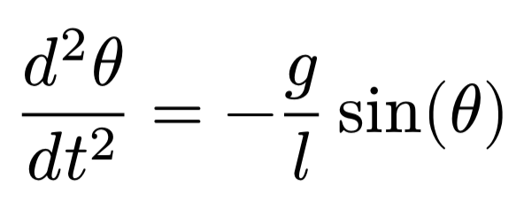
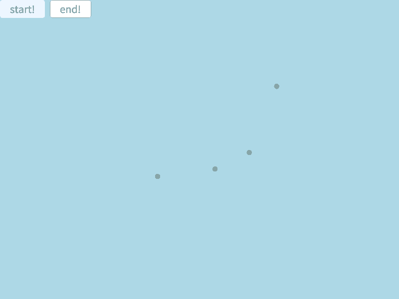
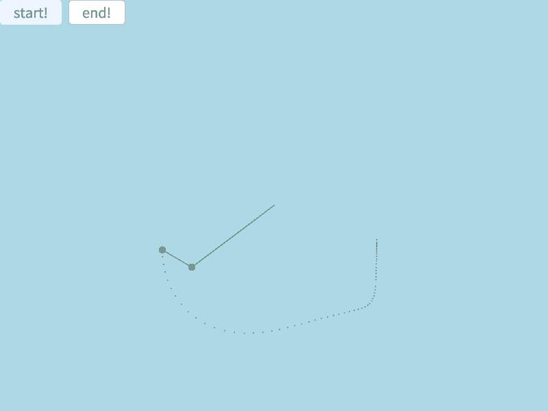

## はじめに
　つい先日、解析力学で振り子の運動についてちょろっと学んだのですが。  
　これシミュレーションしたら面白そうだなあと思ったので、OpenSiv3Dで作りました。  
　動機としてはこれだけです。  
　今回は単振り子と、ちょっと頑張って二重振り子の2つを実装します。  
　この実装のソースコードは[こちらのGitHubページ](https://github.com/Tamagosushio/SushiGUI/blob/main/SushiGUI/Pendulum.hpp)に。  

## 単振り子シミュレーション
　まずは単振り子のシミュレーションを作ります。  
　単振り子の運動方程式は以下のように与えられます。  
    
　いつもの物理学なら、この微分方程式を解いて……とやりますが、今回はシミュレーションなので数値計算です。  
　つまり、この微分方程式から各加速度が求まれば、微小時間をかけて角速度に、さらにもう一回かけて角度にしていけばいいわけです。  
　これをOpenSiv3Dで実装します。  
　とりあえず、シミュレーションに必要なパラメータやメソッドをまとめたクラスを作ります。  
```cpp
/// @brief 単振り子のシミュレーション
class SimplePendulum {
protected:
  const double g = 9.8; // 重力加速度
  const double length0 = 1.0; // 振り子の長さ
  double theta0 = 0.5_pi; // 角度の初期値
  double theta0_v = 0.0; // 角速度
  double theta0_a = 0.0; // 角加速度
  Vec2 coordinate{ 0.0, 0.0 }; // 振り子のx,y座標
  double scale = 1.0; // 振り子のスケール
  Vec2 offset{ 0.0, 0.0 }; // 振り子のオフセット座標
public:
  // 振り子パラメターの初期化
  SimplePendulum(
    double theta = 0.5_pi, double length = 1.0, double gravity = 9.8,
    double scale = 1.0, Vec2 offset = Vec2{ 0.0, 0.0 }
  );
  // 振り子を更新
  void update(void);
  // 振り子のx,y座標を取得
  Vec2 get_coordinate(void) const;
  void set_scale(double scale);
  double get_scale(void) const;
  void set_offset(const Vec2& offset);
  Vec2 get_offset(void) const;
};
```
　シミュレーションに必須のパラメーターとして以下の3つが挙げられます。  
- 初期角度
- 振り子の長さ
- 重力加速度

　角速度、角加速度もシミュレーションでは用いますが、初期条件としてどちらも0.0であるとしておきます。  
　また、振り子のx,y座標とスケール、オフセット座標は、シミュレーションの結果を見やすくするために用います。  
　そして、メソッドの実装です。  
```cpp
/// @brief 単振り子パラメータの初期化
/// @param theta 初期角度 (初期値: pi/2)
/// @param length 振り子の長さ (初期値: 1.0)
/// @param gravity 重力加速度 (初期値: 9.8)
SimplePendulum::SimplePendulum(
  double theta, double length, double gravity,
  double scale, Vec2 offset
) : theta0(theta), length0(length), g(gravity), scale(scale), offset(offset) {}
/// @brief 振り子を更新
/// @return 振り子のx,y座標
void SimplePendulum::update(void) {
  this->theta0_a = -g * Sin(theta0) / length0;
  this->theta0_v += theta0_a * Scene::DeltaTime();
  this->theta0 += theta0_v * Scene::DeltaTime();
  this->coordinate = Vec2{
    length0 * Sin(theta0),
    length0 * Cos(theta0)
  };
}
Vec2 SimplePendulum::get_coordinate(void) const {
  return this->coordinate * scale + offset;
}
```
　一部セッターゲッターのメソッドは省略しています。  
　運動方程式のとおり、角加速度の式を作成します。`this->theta0_a = -g * Sin(theta0) / length0;`  
　まず微小時間dtは、`Scene::DeltaTime()`（60fpsであれば基本的に約0.0167秒）を用います。  
　この微小時間を各加速度にかけて角速度、角速度にかけて角度を計算します。  
　そして、これをx,y座標に変換して、振り子の座標を更新します。座標を取得する際は、座標にスケールをかけてオフセットを足します。  
　こうしてできたものがこちらになります。  
　  
　振り子の長さを変えたり、重力加速度を変えたり、初期角度を変えたりと、各種パラメータをいじったものです。  
　振り子らしい線分は省略していますが、それでもおおよそ大丈夫そうに見えます。  

## 二重振り子シミュレーション
　さて、次は二重振り子のシミュレーションを作ります。  
　二重振り子の運動方程式についてですが、流石に導出とかも面倒なので調べることにします。  
　こちらのQiita記事[「Processingで二重振り子(Double Pendulum)の軌跡を描く」](https://qiita.com/naoyashiga/items/12dfe6003dd14d8cacd6#%E8%A7%92%E9%80%9F%E5%BA%A6)が参考になりそうです。  
　二重振り子のクラスも同様に作成しますが、パラメータやメソッドなど共通箇所が多いので、単振り子クラスを継承して作成します。  
```cpp
/// @brief 二重振り子のシミュレーション
class DoublePendulum : public SimplePendulum {
protected:
  const double mass0 = 1.0; // 0番目の振り子の質量
  const double mass1 = 1.0; // 1番目の振り子の質量
  const double length1 = 1.0;
  double theta1 = 0.5_pi;
  double theta1_v = 0.0;
  double theta1_a = 0.0;
  Vec2 coordinate0{ 0.0, 0.0 };
  Vec2 coordinate1{ 0.0, 0.0 };
public:
  DoublePendulum(
    double theta0 = 0.5_pi, double length0 = 1.0, double mass0 = 1.0,
    double theta1 = 0.5_pi, double length1 = 1.0, double mass1 = 1.0,
    double gravity = 9.8,
    double scale = 1.0, Vec2 off_set = Vec2{ 0.0, 0.0 }
  );
  // 振り子を更新
  void update(void);
  // 0番目の振り子のx,y座標を取得
  Vec2 get_coordinate0(void) const;
  // 1番目の振り子のx,y座標を取得
  Vec2 get_coordinate1(void) const;
};
```
　大きな違いといえば、振り子の質量が必要になったことでしょうか。  
　単振り子であれば、運動方程式の導出過程で質量変数がきれいに消えますが、二重振り子ではそうはいかないですからね。  
　また二重振り子では、0番目の振り子の座標を取得するメソッドと、1番目の振り子の座標を取得するメソッドを作成しておきます。  
　そして、メソッドの実装です。  
```cpp
/// @brief 二重振り子のパラメータの初期値
/// @param theta0 0番目の振り子の初期角度 (初期値: pi/2)
/// @param length0 0番目の振り子の長さ (初期値: 1.0)
/// @param theta1 1番目の振り子の初期角度 (初期値: pi/2)
/// @param length1 1番目の振り子の長さ (初期値: 1.0)
/// @param gravity 重力加速度 (初期値: 9.8) 
DoublePendulum::DoublePendulum(
  double theta0, double length0, double mass0,
  double theta1, double length1, double mass1,
  double gravity,
  double scale, Vec2 off_set  
): SimplePendulum(theta0, length0, gravity, scale, off_set), mass0(mass0), theta1(theta1), length1(length1), mass1(mass1) {}
void DoublePendulum::update(void) {
  double delta_time = Scene::DeltaTime();
  theta0_a = (-g * (2 * mass0 + mass1) * Sin(theta0) - mass1 * g * Sin(theta0 - theta1) - 2 * Sin(theta0 - theta1) * mass1 * (Pow(theta1_v, 2) * length1 + Pow(theta0_v, 2) * length0 * Cos(theta0 - theta1))) / (length0 * (2 * mass0 + mass1 - mass1 * Cos(2 * theta0 - 2 * theta1)));
  theta1_a = (2 * Sin(theta0 - theta1) * (Pow(theta0_v, 2) * length0 * (mass0 + mass1) + g * (mass0 + mass1) * Cos(theta0) + Pow(theta1_v, 2) * length1 * mass1 * Cos(theta0 - theta1))) / (length1 * (2 * mass0 + mass1 - mass1 * Cos(2 * theta0 - 2 * theta1)));
  theta0_v += theta0_a * delta_time;
  theta1_v += theta1_a * delta_time;
  theta0 += theta0_v * delta_time;
  theta1 += theta1_v * delta_time;
  this->coordinate0 = Vec2{
    length0 * Sin(theta0),
    length0 * Cos(theta0)
  };
  this->coordinate1 = Vec2{
    length0 * Sin(theta0) + length1 * Sin(theta1),
    length0 * Cos(theta0) + length1 * Cos(theta1)
  };
}
Vec2 DoublePendulum::get_coordinate0(void)const {
  return this->coordinate0 * scale + offset;
}
Vec2 DoublePendulum::get_coordinate1(void)const {
  return this->coordinate1 * scale + offset;
}                
```
　単振り子クラスのコンストラクタを使用して、変数の初期化を楽しちゃいましょう。  
　あとは運動方程式を頑張って実装します。丸括弧のズレに注意。  
　そうして角加速度を出せたら、単振り子のときと同じように角速度、角度、x,y座標を更新します。  
　早速シミュレーションを行ってみましょう。  
　単振り子よりも複雑な軌跡を描くので、過去の軌跡を残すようにしました。  
　  
　いかにも二重振り子ってかんじが出てきました。先端の振り子がくるくる回るのとか、かなりそれっぽい。  
　せっかく二重振り子を作ったので、カオス性についても確認したいですよね。  
　初期角度を0.500000πと0.499999πにし、それ以外のパラメータを全く同じものにした2つの二重振り子で比較してみます。  
　その差わずか0.000001π。これでも軌跡に違いは出るのでしょうか。  
　  
　開始数秒はどちらも同じように見えますが、その後徐々に軌跡がずれ始め、最終的には全く異なる動きをし始めました。  

## おわりに
　今回は二重振り子のシミュレーションを作成しました。  
　かなり突貫気味な実装でしたが、それでもカオス性がしっかり表れていて、個人としては大満足です。  
　せっかく作ったので何かに活かせるといいなあ、と思っています。まだ何もアイデアはないですが。  


