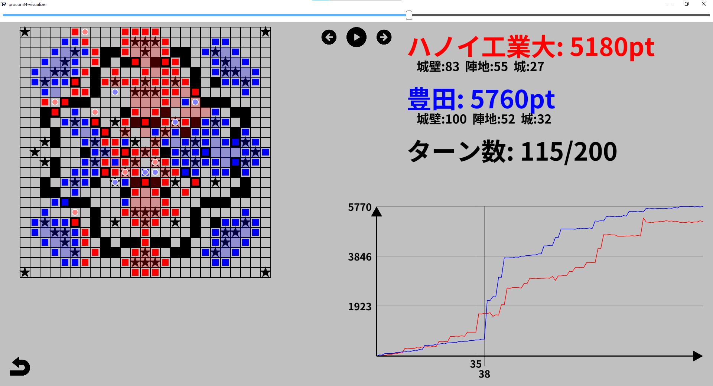
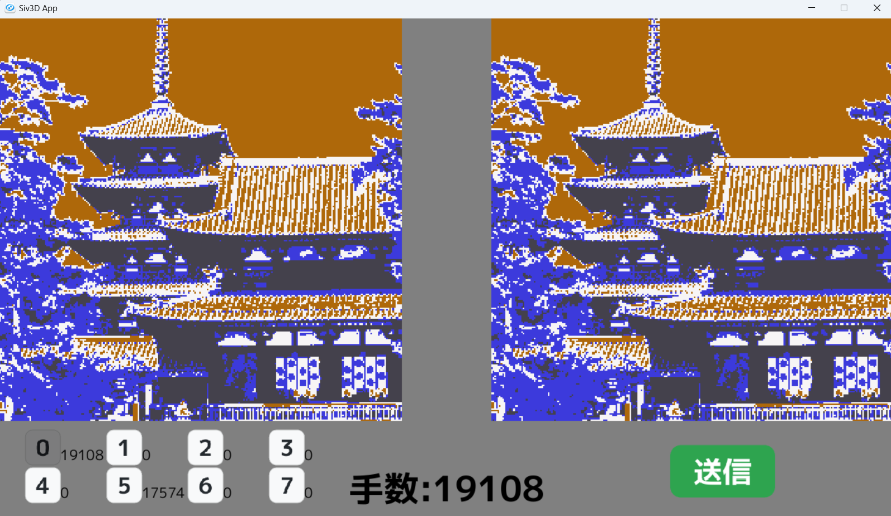
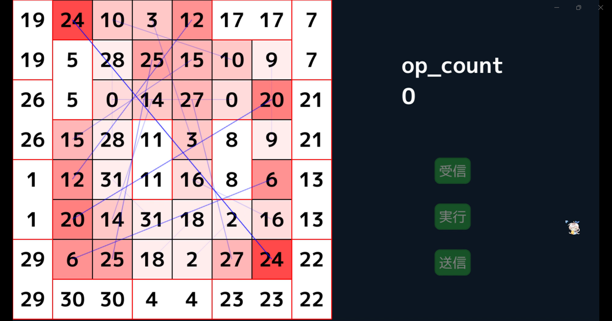
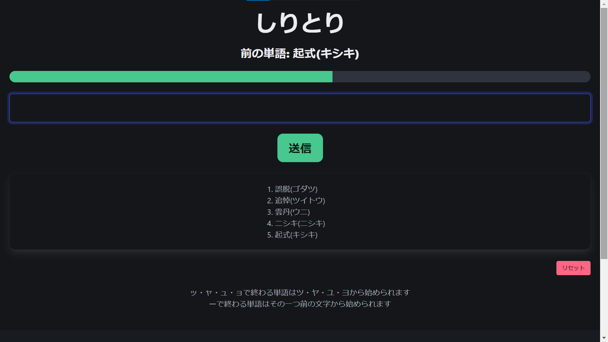
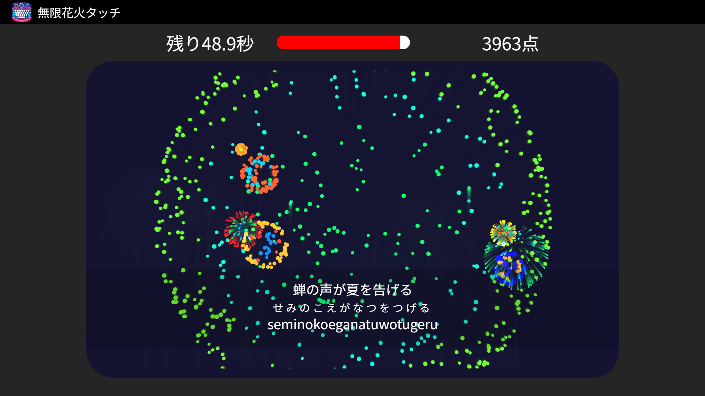

# {{ title }}
{{ description }}

## 高専プロコン関連
第33回,第34回,第35回,第36回の競技部門に計4回出場しました。
### 第33回（群馬）
[https://github.com/UScuber/procon33](https://github.com/UScuber/procon33)  
visualizerを作成しなかったため、通信機能の実装のみを担当しました。  
### 第34回（福井）
[https://github.com/UScuber/procon34](https://github.com/UScuber/procon34)  
visualizerと通信機能を主に担当しました。  
実際に行われた試合のリプレイも、[こちらのページ](/apps/procon34-visualizer-web/index.html)で見ることができます。  
ローカル版で動かしたい方は、[こちらのレポジトリ](https://github.com/Tamagosushio/procon34-visualizer)からダウンロードできます。  
プレイヤーからの入力を受け取る機構と、解を出す実行ファイルを繋げるのに苦労しました。  
これに加え、ターンごとの同期をとる必要もあったため非常に困難でした。  

### 第35回（奈良）
[https://github.com/UScuber/procon35](https://github.com/UScuber/procon35)  
ざっくり開発ブログは[こちらのページ](/blogs/procon35)で。同じくvisualizerと通信機能を担当しました。  
去年と比べユーザーからの入力は、左下の8つ+右下の1つの計9つのみでしたが、描画に悩まされました。  
下の画像は決勝で行われた最大サイズの256×256=65536です。  
使用しているOpenSiv3Dフレームワークで、愚直に1pixelごとに四角形を描画すると非常に重たくなりました。  
そこで、盤面の情報を基に画像データを生成し、描画することで軽量化しました。  
  
### 第36回（島根）
[https://github.com/Tamagosushio/procon36](https://github.com/Tamagosushio/procon36)  
ざっくり開発ブログは[こちらのページ](/blogs/procon36)で。またまた同じくvisualizerと通信機能を担当しました。  
これまでのノウハウがあったため比較的苦労せずに作成できましたが、開発期間がギリギリでした。  
数字ごとに色相を分けるのは非常に見にくかったですが、公式visualizerを参考にして色相ではなく距離に応じて彩度をずらすことで見やすくなりました。  
  

## 過去のインターンシップ関連
### しりとりWebアプリ
[https://github.com/Tamagosushio/jigjp-internship-2024](https://github.com/Tamagosushio/jigjp-internship-2024)  
株式会社jig.jp様のインターンシップに応募した際に作成した選考課題です。  
DenoとBulmaを使用して、楽にモダンなデザインにしました。  
[こちらのDenoサーバー](https://tamagosushi-jigjp-intern.deno.dev)からプレイすることができます。
  
### タイピングゲーム
[https://github.com/jigintern/jigintern-2024-real-d](https://github.com/jigintern/jigintern-2024-real-d)  
上記のインターンシップで、「さわやか」をお題に作成したWebアプリです。私はバックエンドを担当しました。  
[こちらのDenoサーバー](https://mugen-hanabi-touch.deno.dev)からプレイすることができます。  
  

## 趣味・個人開発
いろんなことに手を出してます。時系列順ではないのでご注意を。  
### コミックマーケット
2024年の冬コミ(C105)で技術同人誌を出版しました。  
電子版を[こちらのBoothページ](https://muho.booth.pm/items/6511207)から購入できます。  
いただいたお金は全額絵師様に入ります。  
本のタイトル通り、discord.jsを使用してDiscordBotを作成する入門書です。  

### エスペラント語キーボード
[https://github.com/Tamagosushio/Esperanto-Keyboard](https://github.com/Tamagosushio/Esperanto-Keyboard)  
最近エスペラント語を勉強しております。  
エスペラント語では字上符付き文字（Ĉ,Ĵなど）を使うのですが、普通のキーボードではそのまま打ち込むことはできないです。  
なので、キーボードのみで字上符付き文字を打てるようなWindowsアプリを作成しました。  

### ホームページ
- 現: [https://github.com/Tamagosushio/server-eleventy](https://github.com/Tamagosushio/server-eleventy)
- 旧: [https://github.com/Tamagosushio/server-react](https://github.com/Tamagosushio/server-react)
- 旧旧: [https://github.com/Tamagosushio/server](https://github.com/Tamagosushio/server)

このホームページです。今のところはpublicにしていますが、いつかprivateになるかもしれません。  
### 自作言語
[https://github.com/Tamagosushio/programlingvo](https://github.com/Tamagosushio/programlingvo)  
[こちらのページ](/blogs/programlingvo1)で作成過程をまとめている、エスペラント語をベースとした自作プログラミング言語です。  
現在、かなり重大なバグが残っています……
### PNGバイナリ
[https://github.com/Tamagosushio/cpp-png-binary](https://github.com/Tamagosushio/cpp-png-binary)  
PNGの画像ファイルをバイナリから読み込むことで、より高速な処理を目指す試みです。  
画像や処理によって結果は異なりますが、場合によってはC++のopencvより処理速度を2倍速くなることがありました。  

